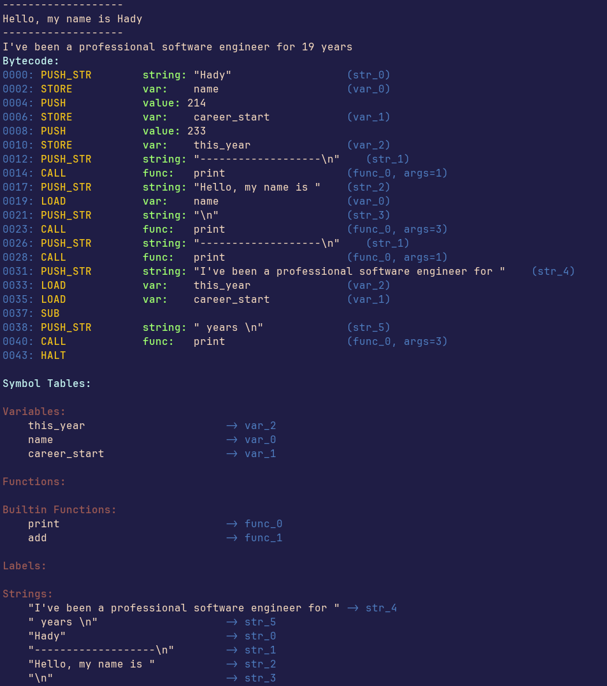
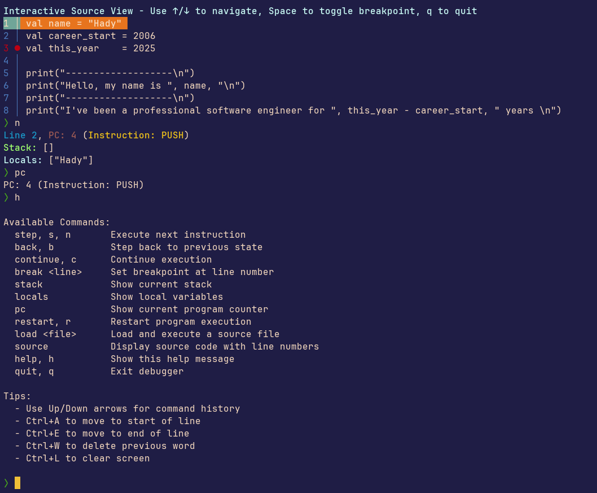

# Opd Lang

Naming is hard okay. Anyway, Opd language is a bytecode compiled toy language
that's not currently meant to be useful. In fact, about the only thing it does
is print strings and do basic math.

The gist of it though is the debugger. Opd is bytecode compiled and bytecode
interpreted, I wanted to implement a step, time-travelling debugger. The goal
was to quickly get from point A to point B so I can start prototyping the
debugger. The purpose is not to build or design a language, implement a good
compiler or AST to bytecode translation.

## Inspect the Bytecode

Here's an example of a bytecode dump for [simple.dl](./samples/simple.dl)

```sh
go run . compile samples/simple.dl -o simple.bc -r -lnone -d
```



Running `go run . compile -h` will give you all the details you need to know
about the flags but for a quick reference regarding the above command:

- `-o` sets the output file for the compiled bytecode
- `-r` will run the compiled bytecode
- `-l` will set the logging level to `none`, we're only interested in the
  program's output
- `-d` will dump the bytecode in the format you see above for inspection

## Debug the Bytecode

Here's an example of a debugging session for [simple.dl](./samples/simple.dl)

```sh
go run . compile samples/simple.dl -o simple.bc -r -lnone -d -s
```



- `-s` will start execution in the step debugger with a breakpoint on line 1 of
  the source code

During debugging you can always inspect the source visually to see where you are
in the execution line wise and where your breakpoints are at using `source`

```sh
> source
```

You can move the program counter forward or backwards using `n` or `b`.

### Current bytecode limitiations

There's one glaring limitation in the current implementation of the compiler
which I alluded to in [run.go](./run.go) is that we don't store enough of the
metadata with the bytecode needed for the VM and the debugger to run straight
from the bytecode.

And the things we do store we don't read back from the bytecode file. The result
of that is we need to go from AST->Bytecode->VM/Debugger. Hopefully will have
time to fix it in the near future, for now it serves the original purpose.
